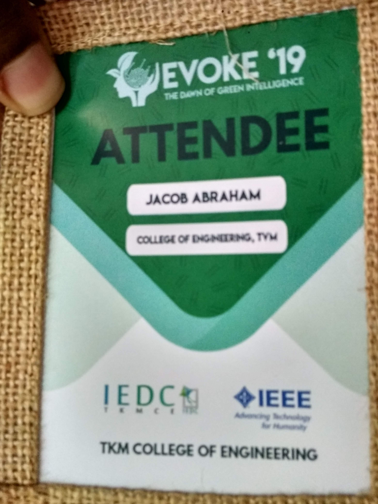
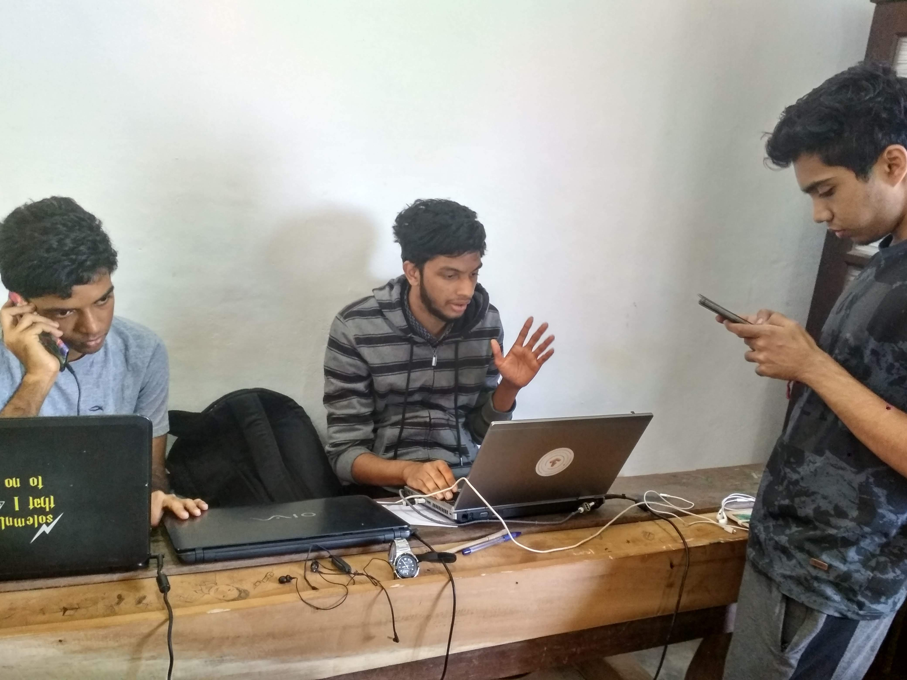
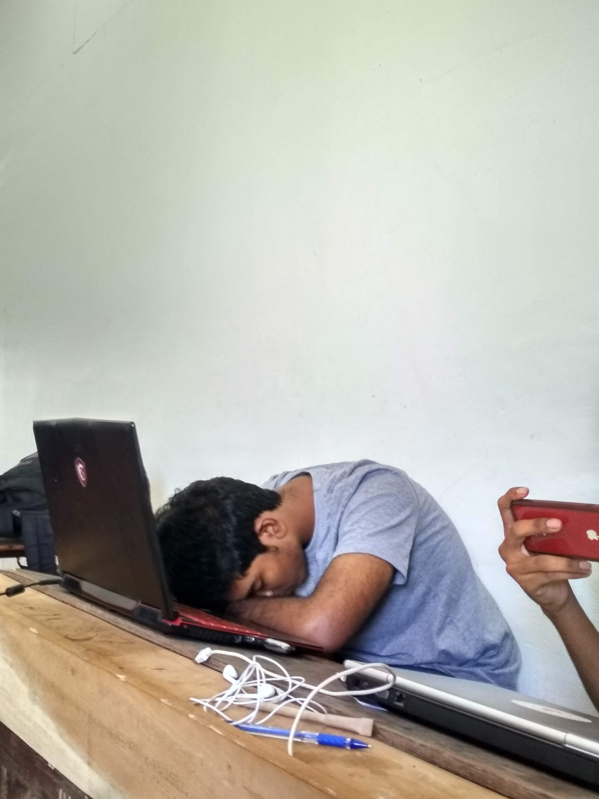
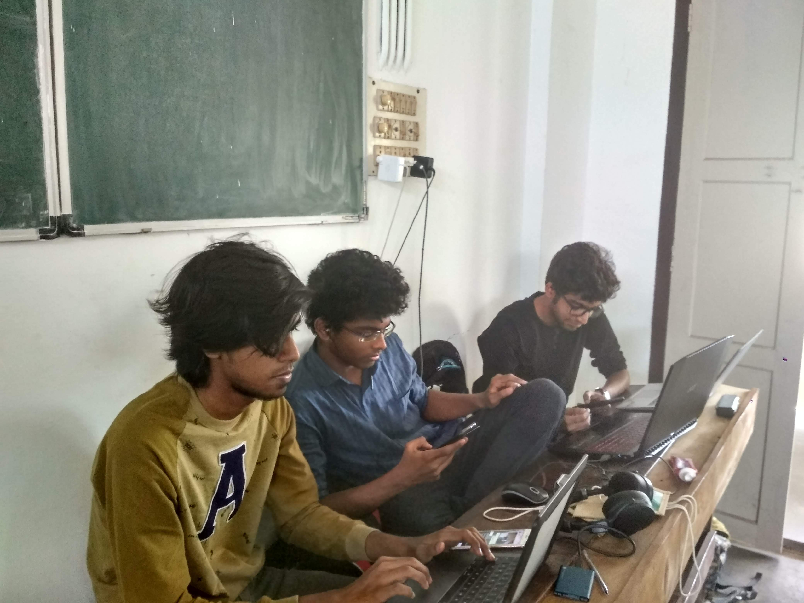
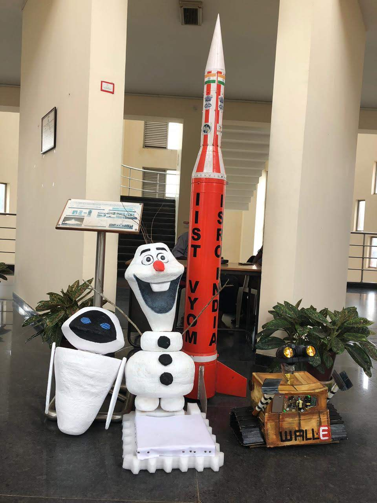
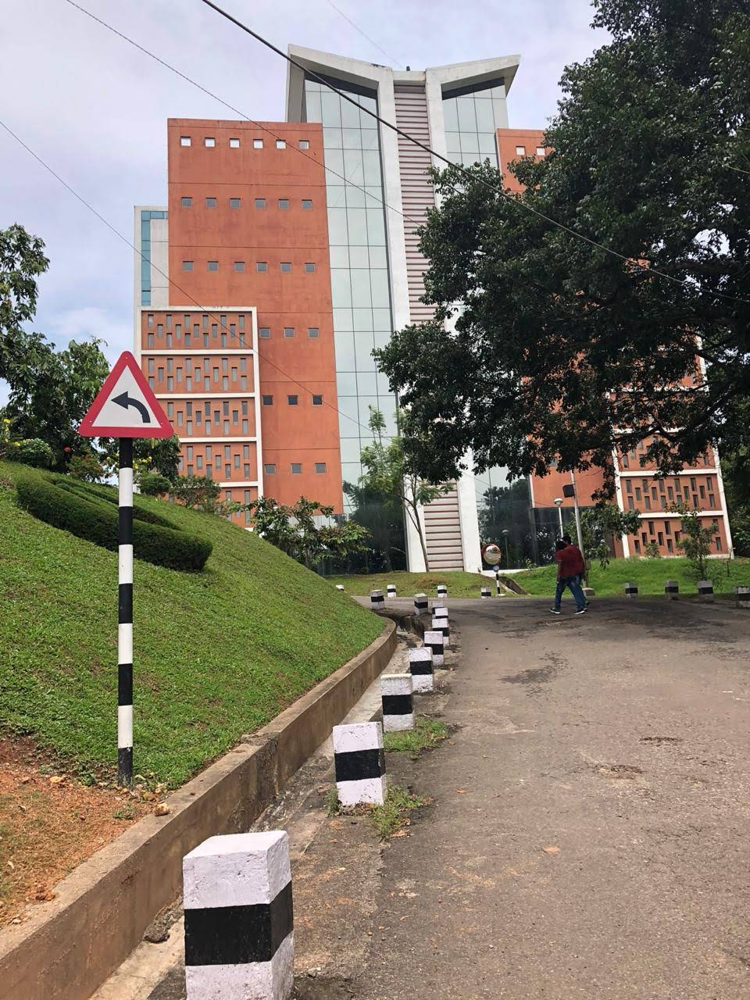
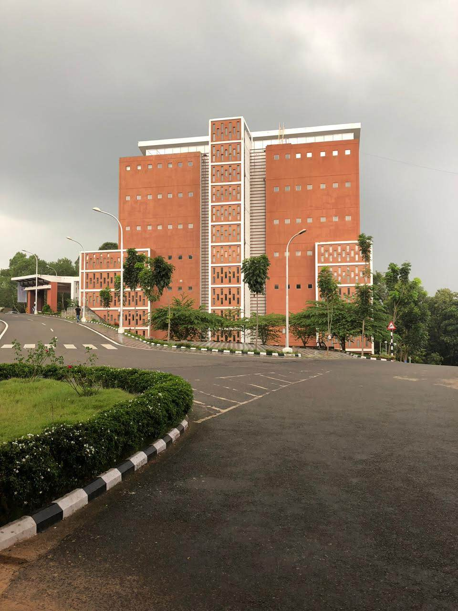
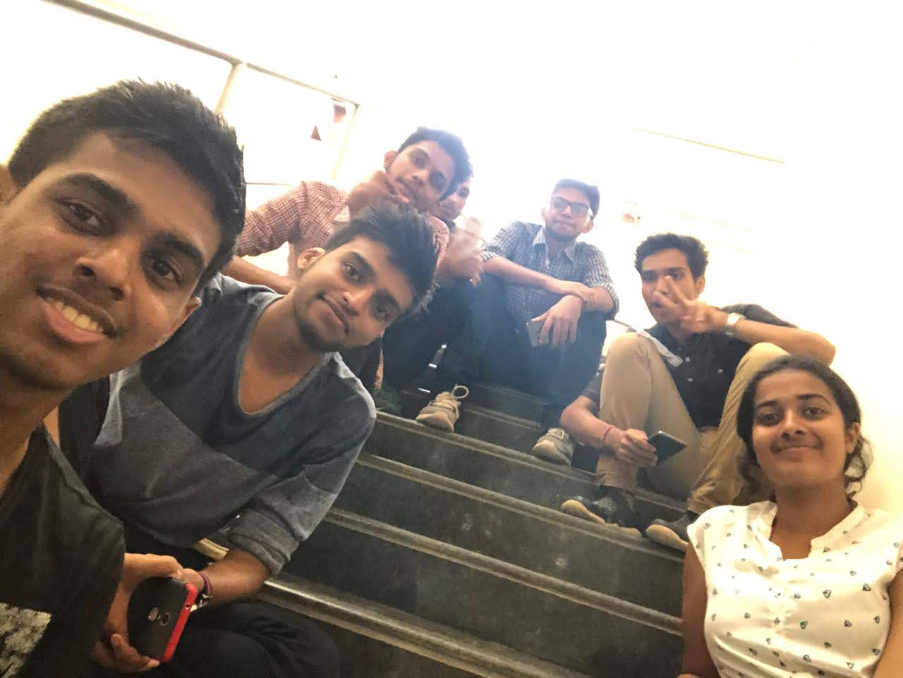

## Welcome to a chapter of Me
I am Jacob Abraham. A student of Computer Science and Engineering from India. I am very much enthusiastic and interested in the field of programming. 

I am using this platform to express my love towards coding and its various fields.

## Evoke TKM 2019

My first ever Hackathon experience was at TKM. My friends and I on a whim took a train and went there to see what a "hackathon" is. We had a lot of fun on those 2 days. It was on 2nd February, 2019. A 24 hour hackathon and we were surprised and excited to hear our victory and about the internship offers provided.

## Dhanak IIST 2018

My friends and I visited this beautiful campus just a few months after joining college. It was a beautiful experiences and we had a wonderful time. It was on September 29, 2018. We visited the campus during their fest, Dhanak.

### Contact

Email  : jacob13400@cet.ac.in 

Github : [Github Page](https://github.com/jacob13400)

LinkedIn : [LinkedIn Page](https://www.linkedin.com/in/jacob-abraham-3b4b05190/)
